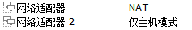
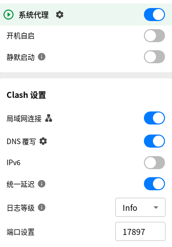
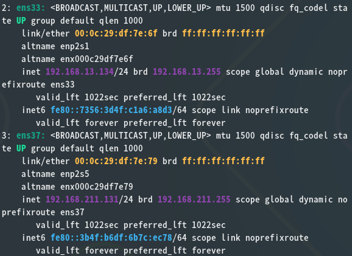
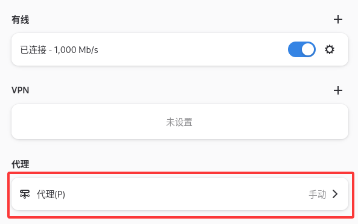
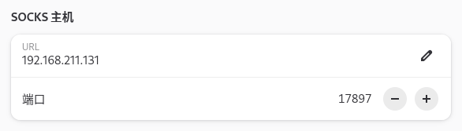

> 本教程需要 1 台连接互联网的实体机，2 个虚拟机，使用镜像：
> `debian-13.6.0-amd64-DVD-1.iso`

## 1. 原理

这里我们称已连接互联网的实体机为宿主机，A 虚拟机需要设置双网卡，一个设置为 NAT，一个设置为 HOST-ONLY，B 虚拟机需要设置网卡为 HOST-ONLY，宿主机为 A 虚拟机提供互联网，A 虚拟机中安装代理软件，A 虚拟机与 B 虚拟机互通，B 虚拟机是否能上网通过 A 虚拟机的代理软件控制，B 虚拟机不通过其它方式连接互联网。

## 2. 虚拟机设置

A 虚拟机网卡：



B 虚拟机网卡：


A 虚拟机代理软件以 `Clash Verge` 为例

`Clash Verge` 显示问题修复：

如果 `Clash Verge` 打开后主界面黑屏
把 `/usr/share/applications/Clash Verge.desktop` 复制到 `~/.local/share/applications/Clash Verge.desktop`，并把其中一行改掉：

```bash
# 原版（系统级）
Exec=clash-verge %u

# 覆盖后（用户级，你现在实际生效的）
Exec=env WEBKIT_DISABLE_COMPOSITING_MODE=1 WEBKIT_DISABLE_DMABUF_RENDERER=1 clash-verge %u
```

> 原因：Clash Verge 是 Tauri 应用，界面用 WebKitGTK 渲染，它在 VMware 虚拟显卡上硬件合成有 bug，导致 WebView 黑屏。

软件设置：



B 虚拟机代理设置：

先查看 A 虚拟机网卡信息：

```bash
ip a
```



这里 `ens37` 的 IP 是 HOST-ONLY 的 IP，我们需要将它填入 B 虚拟机的代理中，端口号为 Clash Verge 里设置的端口号。





B 虚拟机开启网络代理后，即可通过 A 虚拟机代理转发上网。
