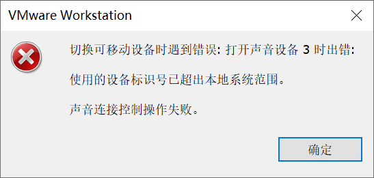
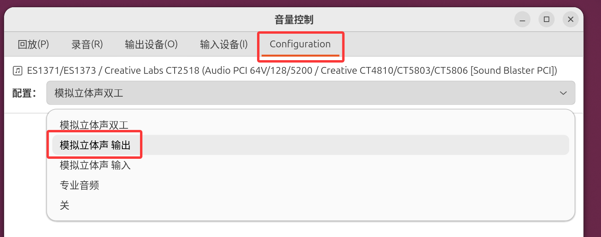

本文记录 VMware 17 Ubuntu 26.04 在遇到打开**设置 → 声音**后 VMware 声卡必定离线这种情况应该如何解决。

## 1. 确认当前设备状态

我的宿主机安装了 Voicemeeter，其中音响由 Voicemeeter Input 接管，耳机由 Voicemeeter AUX Input 接管。

Ubuntu 虚拟机声卡指定的虚拟机声卡为：Voicemeeter AUX Input。

## 2. 状况复现

1. 确认 Ubuntu 虚拟机选择的声卡为 Voicemeeter AUX Input
2. 打开 Ubuntu 虚拟机
3. 打开**设置 → 声音**
4. 确认 VMware 声卡是否离线



## 3. 解决问题

在解决问题前，我们要搞清楚问题是什么原因导致的。

导致这个问题的原因是：Ubuntu 检测音频设备的时候没有检测到音频输入设备就调用，导致 VMware 报错。

解决方案是安装 pavucontrol。

执行以下命令安装：

```bash
sudo apt-get install pavucontrol
```

安装后打开 pavucontrol（音量控制），点击 Configuration，在配置中将**模拟立体声双工**更改成**模拟立体声 输出**，更改后重启 Ubuntu 虚拟机。


